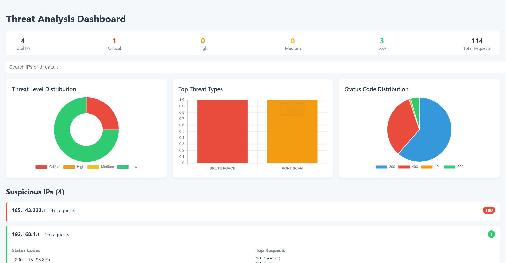

# 🕵️ SOC Log Analyzer - Advanced Threat Detection Tool

[](https://www.python.org/)
[](https://opensource.org/licenses/MIT)
[](https://github.com/TouyA0/SOC-Python-Tools/tree/main/log_analyzer)


## 🌟 Key Features

### 🔍 Threat Detection Engine
| Threat Type            | Detection Method                     | Example Patterns                         |
|------------------------|--------------------------------------|------------------------------------------|
| `Brute Force Attacks`  | Repeated auth failures               | 10+ POST /login (401)                    |
| `Port Scanning`        | High unique request paths            | 50+ requests to 20+ endpoints            |
| `SQL Injection`        | SQL pattern matching                 | UNION SELECT, DROP TABLE, 1=1            |
| `DDoS Attacks`         | Abnormal request rate                | 500+ requests/minute from single IP      |
| `Suspicious Behavior`  | Non-whitelisted external activity    | External IP accessing admin endpoints    |

## 🛠 Installation

1. Clone the repository:
```bash
git clone https://github.com/TouyA0/SOC-Python-Tools.git
```
2. Navigate to the project directory:
```bash
cd SOC-Python-Tools/log_analyzer
```
3. Install dependencies:
```bash
pip install -r requirements.txt
```

## 🚀 Basic Usage

```bash
log-analyzer --help  # Show all options

# Analyze Apache-style logs
log-analyzer access.log -t 100 -tw 1.5 -o report

# Real-time monitoring
log-analyzer /var/log/nginx/access.log --watch -t 50
```

## 🎚️ Command-Line Options

| Short | Long               | Description                     | Default               |
|-------|--------------------|---------------------------------|-----------------------|
| `-t`  | `--threshold`      | Request threshold per IP        | 100                   |
| `-tw` | `--timewindow`     | Analysis window (hours)         | 1.0                   |
| `-i`  | `--ignore-internal`| Exclude RFC1918 IPs             | False                 |
| `-w`  | `--whitelist`      | Whitelist file path             | date/whitelist.txt    |
|       | `--no-whitelist`   | Disable whitelist filtering     | False                 |
| `-o`  | `--output`         | Report base name                | suspicious_ips_report |
|       | `--watch`          | Enable real-time monitoring     | False                 |
|       | `--min-interval`   | Minimum scan interval (seconds) | 5                     |

## ⚙️ Advanced Configuration

### 1. Whitelist Formatting
```bash
# Valid formats:
192.168.1.1                  # IPv4 single
192.168.1.0/24               # IPv4 CIDR
2001:0db8:85a3::8a2e:0370:7334  # IPv6 single
2001:db8::/32                # IPv6 CIDR
# Comments are ignored
```

### 2. Log Pattern Customization
Default regex for Apache/NGINX logs:
```bash
# From detection.py
ip_pattern = r'^(\S+)'  # Client IP
date_pattern = r'\[([^\]]+)\]'  # Timestamp
status_pattern = r'" (\d{3}) '  # HTTP status
request_pattern = r'"(\S+) (\S+)'  # Method + path
```

### 3. Threat Rule Tuning
Edit config.py to modify detection logic:
```bash
THREAT_CONFIG = {
    'BRUTE_FORCE': {
        'status_codes': ['401', '403'],
        'paths': ['/login', '/wp-login.php'],
        'threshold': 10,  # ← Adjust this value
        'score_weight': 15
    },
    # ... other rules ...
}
```
## 📈 Report System

### Output Structure
```bash
outputs/
├── report.html       # Interactive dashboard
└── report.csv        # Machine-readable data
```

### CSV Report Sample
```bash
IP Address,Threat Score,Total Requests,First Seen,Last Seen...
185.143.223.1,100,47,2023-01-01 12:00:04,2023-01-01 12:00:49...
```

### HTML Report Sample

*Interactive HTML dashboard with drill-down capabilities*

## 🔍 Real-World Scenarios

### WordPress Security Audit
```bash
log-analyzer wp_access.log \
  -t 25 \
  -w wp_whitelist.txt \
  -o wp_threats \
  --ignore-internal
```

### Incident Investigation
```bash
log-analyzer hacked_server.log \
  -tw 0.5 \
  -t 20 \
  -o forensic_case_123
```

### Cloud Load Balancer Analysis
```bash
log-analyzer "alb_logs/*.log" \
  -t 300 \
  -o aws_security \
  --no-whitelist
```

## 🚨 Troubleshooting Guide

| Symptom                       | Cause                          | Solution                          |
|-------------------------------|--------------------------------|-----------------------------------|
| **Log file not found**        | Incorrect path/permissions     | Verify file exists and use `sudo` if needed |
| **Invalid whitelist entries** | Malformed IP/CIDR              | Check format in `data/whitelist.txt` |
| **High CPU/Memory usage**     | Large log files                | Use `--min-interval 10` to reduce scans |
| **Watch mode not working**    | Filesystem events blocked      | Ensure `watchdog` is installed (`pip install watchdog`) |
| **No threats detected**       | Threshold too high             | Lower `--threshold` value         |
| **False positives**           | Whitelist incomplete           | Add legitimate IPs to whitelist   |
| **Encoding errors**           | Non-UTF8 log files             | Convert logs with `iconv -f latin1 -t utf-8` |
| **Empty CSV reports**         | No suspicious activity         | Check detection rules in `config.py` |
| **Dashboard not rendering**   | JavaScript blocked             | Open in modern browser (Chrome/Firefox) |
| **Port scan false alerts**    | Legitimate API traffic         | Adjust `unique_paths_threshold` in config |

## 📜 License
This project is licensed under the MIT License - see the [LICENSE](https://github.com/TouyA0/SOC-Python-Tools/blob/main/LICENSE) file for details.

## Contribute 
[](https://github.com/TouyA0/SOC-Python-Tools/issues)
[](https://github.com/TouyA0/SOC-Python-Tools/discussions)
